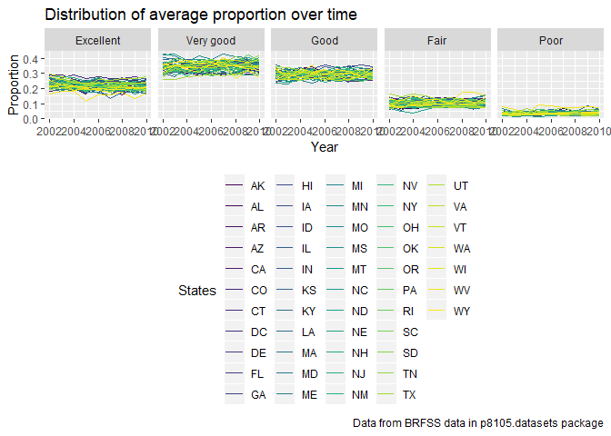
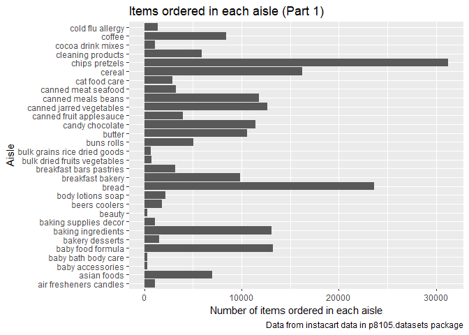
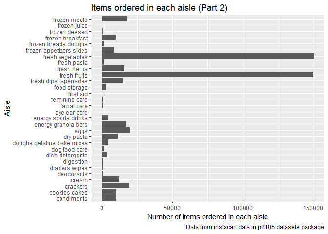
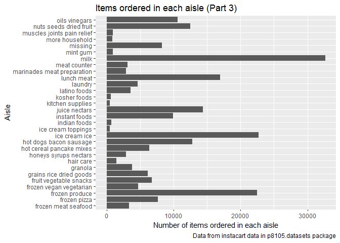
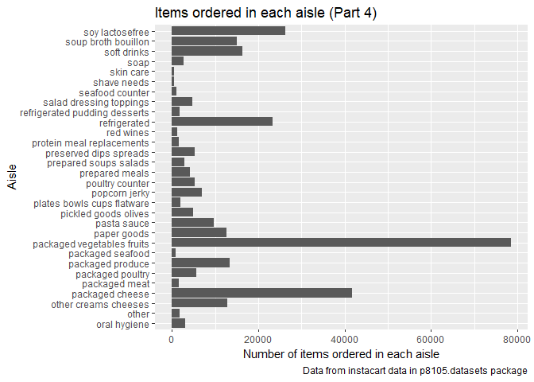
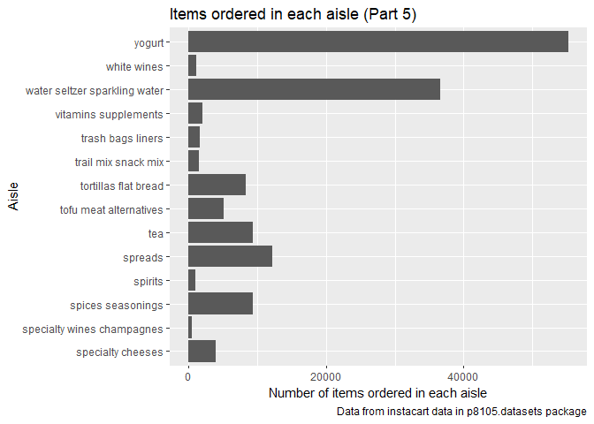
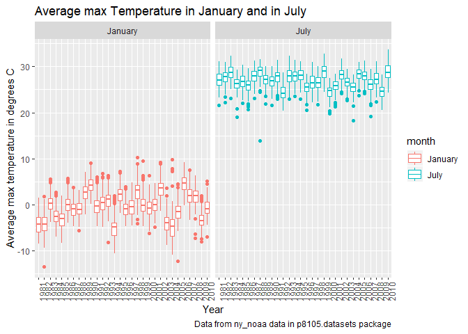

P8105\_hw3\_sy2825
================
Shuo Yan (sy2825)
2018-10-12

Problem 1
=========

First, let's import and clean the BRFSS data.

``` r
library(p8105.datasets)

data(brfss_smart2010)

brfss_clean = janitor::clean_names(brfss_smart2010) %>%
  rename(state = locationabbr, state_and_county = locationdesc, lower_confidence_limit = confidence_limit_low, 
         higher_confidence_limit = confidence_limit_high) %>%
  filter(topic == "Overall Health") %>%
  mutate(
    response = factor(response, c("Excellent", "Very good", "Good", "Fair", "Poor"))
  )
  
  
 
brfss_clean
```

    ## # A tibble: 10,625 x 23
    ##     year state state_and_county class topic question response sample_size
    ##    <int> <chr> <chr>            <chr> <chr> <chr>    <fct>          <int>
    ##  1  2010 AL    AL - Jefferson ~ Heal~ Over~ How is ~ Excelle~          94
    ##  2  2010 AL    AL - Jefferson ~ Heal~ Over~ How is ~ Very go~         148
    ##  3  2010 AL    AL - Jefferson ~ Heal~ Over~ How is ~ Good             208
    ##  4  2010 AL    AL - Jefferson ~ Heal~ Over~ How is ~ Fair             107
    ##  5  2010 AL    AL - Jefferson ~ Heal~ Over~ How is ~ Poor              45
    ##  6  2010 AL    AL - Mobile Cou~ Heal~ Over~ How is ~ Excelle~          91
    ##  7  2010 AL    AL - Mobile Cou~ Heal~ Over~ How is ~ Very go~         177
    ##  8  2010 AL    AL - Mobile Cou~ Heal~ Over~ How is ~ Good             224
    ##  9  2010 AL    AL - Mobile Cou~ Heal~ Over~ How is ~ Fair             120
    ## 10  2010 AL    AL - Mobile Cou~ Heal~ Over~ How is ~ Poor              66
    ## # ... with 10,615 more rows, and 15 more variables: data_value <dbl>,
    ## #   lower_confidence_limit <dbl>, higher_confidence_limit <dbl>,
    ## #   display_order <int>, data_value_unit <chr>, data_value_type <chr>,
    ## #   data_value_footnote_symbol <chr>, data_value_footnote <chr>,
    ## #   data_source <chr>, class_id <chr>, topic_id <chr>, location_id <chr>,
    ## #   question_id <chr>, respid <chr>, geo_location <chr>

Now we can use our dataset to answer the following questions.

\*In 2002, which states were observed at 7 locations?

``` r
brfss_clean %>%
  filter(year == "2002") %>%
  group_by(state) %>%
  summarize(n_locations = n_distinct(state_and_county)) %>%
  filter(n_locations == 7)
```

    ## # A tibble: 3 x 2
    ##   state n_locations
    ##   <chr>       <int>
    ## 1 CT              7
    ## 2 FL              7
    ## 3 NC              7

From the table we can see that states CT, FL, and NC were observed at 7 locations.

\*Make a “spaghetti plot” that shows the number of locations in each state from 2002 to 2010.

``` r
brfss_clean %>%
  group_by(year, state) %>%
  summarize(n_locations = n_distinct(state_and_county)) %>%
  ggplot(aes(x = year, y = n_locations)) +
  geom_line(aes(color = state)) +
  labs(
    title = "Number of locations in each state from 2002 to 2010",
    x = "Year",
    y = "Number of locations",
    caption = "Data from BRFSS data in p8105.datasets package"
  ) +
  viridis::scale_color_viridis(
    name = "States", 
    discrete = TRUE
  )
```

 From the spaghetti plot above we can see that state FL has big differences of the number of observed locations from 2002 to 2010.

\*Make a table showing, for the years 2002, 2006, and 2010, the mean and standard deviation of the proportion of “Excellent” responses across locations in NY State.

``` r
brfss_clean %>%
  filter(year == "2002" | year == "2006" | year == "2010", state == "NY", response == "Excellent") %>%
  group_by(Year = year) %>%
  summarize(Mean = mean(data_value)/100, Standard_deviation = sd(data_value)/100) %>%
  knitr::kable(digits = 2)
```

|  Year|  Mean|  Standard\_deviation|
|-----:|-----:|--------------------:|
|  2002|  0.24|                 0.04|
|  2006|  0.23|                 0.04|
|  2010|  0.23|                 0.04|

From the table we can see that the mean and standard deviation of the proportion of "Excellent" responses across locations in NY state have few differences between year 2002, 2006, and 2010.

\*For each year and state, compute the average proportion in each response category (taking the average across locations in a state). Make a five-panel plot that shows, for each response category separately, the distribution of these state-level averages over time.

``` r
brfss_average_proportion = brfss_clean %>%
  group_by(Year = year, State = state, Response = response) %>%
  summarize(Proportion = mean(data_value)/100)

brfss_average_proportion
```

    ## # A tibble: 2,215 x 4
    ## # Groups:   Year, State [?]
    ##     Year State Response  Proportion
    ##    <int> <chr> <fct>          <dbl>
    ##  1  2002 AK    Excellent      0.279
    ##  2  2002 AK    Very good      0.337
    ##  3  2002 AK    Good           0.238
    ##  4  2002 AK    Fair           0.086
    ##  5  2002 AK    Poor           0.059
    ##  6  2002 AL    Excellent      0.185
    ##  7  2002 AL    Very good      0.309
    ##  8  2002 AL    Good           0.327
    ##  9  2002 AL    Fair           0.121
    ## 10  2002 AL    Poor           0.059
    ## # ... with 2,205 more rows

``` r
brfss_average_proportion %>%
ggplot(aes(x = Year, y = Proportion, color = State)) +
  geom_line() +
  labs(
    title = "Distribution of average proportion over time",
    x = "Year",
    y = "Proportion",
    caption = "Data from BRFSS data in p8105.datasets package"
  ) +
  viridis::scale_color_viridis(
    name = "States", 
    discrete = TRUE
  ) +
  facet_grid(. ~ Response) +
  theme(legend.position = "bottom")
```

    ## Warning: Removed 1 rows containing missing values (geom_path).



From the plots wo can see that "very good" response has highest proportion.

Problem 2
=========

First, let's import and clean the instacart data.

``` r
data(instacart)

instacart_clean = janitor::clean_names(instacart)
```

Then let's explore this dataset.

``` r
dim(instacart_clean)
```

    ## [1] 1384617      15

``` r
instacart_clean
```

    ## # A tibble: 1,384,617 x 15
    ##    order_id product_id add_to_cart_ord~ reordered user_id eval_set
    ##       <int>      <int>            <int>     <int>   <int> <chr>   
    ##  1        1      49302                1         1  112108 train   
    ##  2        1      11109                2         1  112108 train   
    ##  3        1      10246                3         0  112108 train   
    ##  4        1      49683                4         0  112108 train   
    ##  5        1      43633                5         1  112108 train   
    ##  6        1      13176                6         0  112108 train   
    ##  7        1      47209                7         0  112108 train   
    ##  8        1      22035                8         1  112108 train   
    ##  9       36      39612                1         0   79431 train   
    ## 10       36      19660                2         1   79431 train   
    ## # ... with 1,384,607 more rows, and 9 more variables: order_number <int>,
    ## #   order_dow <int>, order_hour_of_day <int>,
    ## #   days_since_prior_order <int>, product_name <chr>, aisle_id <int>,
    ## #   department_id <int>, aisle <chr>, department <chr>

``` r
information_explore = matrix(c(
  nrow(distinct(instacart_clean, product_name)), nrow(distinct(instacart_clean, product_id)),
  
  nrow(distinct(instacart_clean, aisle)), nrow(distinct(instacart_clean, aisle_id)),
  
  nrow(distinct(instacart_clean, department)), nrow(distinct(instacart_clean, department_id))), ncol = 3
)

colnames(information_explore) = c("Product", "Aisle", "Department")
rownames(information_explore) = c("Count of different names", "Count of different id")

as.table(information_explore)
```

    ##                          Product Aisle Department
    ## Count of different names   39123   134         21
    ## Count of different id      39123   134         21

We can see that this 1384617 \* 15 dataset includes the order information about 39123 different food product and also the identity information of each product such as product name, product id, aisle, and department. There are 134 different aisles and 21 departments in total and each aisle and department has its unique id number.

\*How many aisles are there, and which aisles are the most items ordered from?

``` r
sort(
  table(instacart_clean$aisle), decreasing = TRUE
  )[1]
```

    ## fresh vegetables 
    ##           150609

As we concluded before, there are 134 different aisles intotal. "Fresh vegetables"" is the aisle which the most items ordered from.

\*Make a plot that shows the number of items ordered in each aisle. Order aisles sensibly, and organize your plot so others can read it.

``` r
aisle_data = instacart_clean %>%
  group_by(aisle) %>%
  summarize(n_items = n())

aisle_part_1 = head(aisle_data, 30)

aisle_part_1 %>%
ggplot(aes(x = aisle, y = n_items)) +
  geom_col() +
  coord_flip() +
  labs(
    title = "Items ordered in each aisle (Part 1)",
    x = "Aisle",
    y = "Number of items ordered in each aisle",
    caption = "Data from instacart data in p8105.datasets package"
  ) 
```



``` r
aisle_part_2 = slice(aisle_data, 31:60)

aisle_part_2 %>%
  ggplot(aes(x = aisle, y = n_items)) +
  geom_col() +
  coord_flip() +
  labs(
    title = "Items ordered in each aisle (Part 2)",
    x = "Aisle",
    y = "Number of items ordered in each aisle",
    caption = "Data from instacart data in p8105.datasets package"
  )
```



``` r
aisle_part_3 = slice(aisle_data, 61:90)

aisle_part_3 %>%
  ggplot(aes(x = aisle, y = n_items)) +
  geom_col() +
  coord_flip() +
  labs(
    title = "Items ordered in each aisle (Part 3)",
    x = "Aisle",
    y = "Number of items ordered in each aisle",
    caption = "Data from instacart data in p8105.datasets package"
  )
```



``` r
aisle_part_4 = slice(aisle_data, 91:120)

aisle_part_4 %>%
  ggplot(aes(x = aisle, y = n_items)) +
  geom_col() +
  coord_flip() +
  labs(
    title = "Items ordered in each aisle (Part 4)",
    x = "Aisle",
    y = "Number of items ordered in each aisle",
    caption = "Data from instacart data in p8105.datasets package"
  )
```



``` r
aisle_part_5 = slice(aisle_data, 121:134)

aisle_part_5 %>%
  ggplot(aes(x = aisle, y = n_items)) +
  geom_col() +
  coord_flip() +
  labs(
    title = "Items ordered in each aisle (Part 5)",
    x = "Aisle",
    y = "Number of items ordered in each aisle",
    caption = "Data from instacart data in p8105.datasets package"
  )
```



\*Make a table showing the most popular item in each of the aisles “baking ingredients”, “dog food care”, and “packaged vegetables fruits”.

``` r
 instacart_clean %>%
  filter(aisle == "baking ingredients" | aisle == "dog food care" | aisle == "packaged vegetables fruits") %>%
group_by(Aisle = aisle, Most_popular_product = product_name) %>% 
  summarize(n_items = n()) %>%
  mutate(Product_rank = min_rank(desc(n_items))) %>% 
  filter(Product_rank == 1) %>%
  select(Aisle, Most_popular_product) %>%
  knitr::kable()
```

| Aisle                      | Most\_popular\_product                        |
|:---------------------------|:----------------------------------------------|
| baking ingredients         | Light Brown Sugar                             |
| dog food care              | Snack Sticks Chicken & Rice Recipe Dog Treats |
| packaged vegetables fruits | Organic Baby Spinach                          |

\*Make a table showing the mean hour of the day at which Pink Lady Apples and Coffee Ice Cream are ordered on each day of the week; format this table for human readers (i.e. produce a 2 x 7 table).

``` r
instacart_clean %>%
  mutate(order_dow = recode(order_dow, 
    "0" = "Monday", "1" = "Tuesday", "2" = "Wednesday", "3" = "Thursday", "4" = "Friday",
    "5" = "Saturday", "6" = "Sunday")) %>%
  filter(product_name == "Pink Lady Apples" | product_name == "Coffee Ice Cream") %>%
  group_by(Product_name = product_name, order_dow) %>%
  summarize(mean_hour = mean(order_hour_of_day)) %>%
  spread(key = order_dow, value = mean_hour) %>%
  knitr::kable(digits = 2)
```

| Product\_name    |  Friday|  Monday|  Saturday|  Sunday|  Thursday|  Tuesday|  Wednesday|
|:-----------------|-------:|-------:|---------:|-------:|---------:|--------:|----------:|
| Coffee Ice Cream |   15.22|   13.77|     12.26|   13.83|     15.32|    14.32|      15.38|
| Pink Lady Apples |   11.55|   13.44|     12.78|   11.94|     14.25|    11.36|      11.70|

Problem 3
=========

First, let's import and have a look at the NY NOAA data.

``` r
data(ny_noaa)

 ny_noaa
```

    ## # A tibble: 2,595,176 x 7
    ##    id          date        prcp  snow  snwd tmax  tmin 
    ##    <chr>       <date>     <int> <int> <int> <chr> <chr>
    ##  1 US1NYAB0001 2007-11-01    NA    NA    NA <NA>  <NA> 
    ##  2 US1NYAB0001 2007-11-02    NA    NA    NA <NA>  <NA> 
    ##  3 US1NYAB0001 2007-11-03    NA    NA    NA <NA>  <NA> 
    ##  4 US1NYAB0001 2007-11-04    NA    NA    NA <NA>  <NA> 
    ##  5 US1NYAB0001 2007-11-05    NA    NA    NA <NA>  <NA> 
    ##  6 US1NYAB0001 2007-11-06    NA    NA    NA <NA>  <NA> 
    ##  7 US1NYAB0001 2007-11-07    NA    NA    NA <NA>  <NA> 
    ##  8 US1NYAB0001 2007-11-08    NA    NA    NA <NA>  <NA> 
    ##  9 US1NYAB0001 2007-11-09    NA    NA    NA <NA>  <NA> 
    ## 10 US1NYAB0001 2007-11-10    NA    NA    NA <NA>  <NA> 
    ## # ... with 2,595,166 more rows

``` r
dim(ny_noaa)
```

    ## [1] 2595176       7

``` r
ny_noaa_distinct_value = matrix(
  c(
    nrow(distinct(ny_noaa, id)), nrow(distinct(ny_noaa, date))
    ), ncol = 2)

colnames(ny_noaa_distinct_value) = c("id", "date")
rownames(ny_noaa_distinct_value) = c("Count of distinct value")

as.table(ny_noaa_distinct_value)
```

    ##                            id  date
    ## Count of distinct value   747 10957

``` r
ny_noaa_na = matrix(c(
  
  sum(is.na(ny_noaa$id)), sum(is.na(ny_noaa$date)),
  
  sum(is.na(ny_noaa$prcp)), sum(is.na(ny_noaa$snow)),
  
  sum(is.na(ny_noaa$snwd)), sum(is.na(ny_noaa$tmax)),
  
  sum(is.na(ny_noaa$tmin))), ncol = 7
)

colnames(ny_noaa_na) = c("id", "date", "prcp", "snow", "snwd", "tmax", "tmin")
rownames(ny_noaa_na) = c("Count of NA")

as.table(ny_noaa_na)
```

    ##                  id    date    prcp    snow    snwd    tmax    tmin
    ## Count of NA       0       0  145838  381221  591786 1134358 1134420

We can see that this is a 2595176 \* 7 dataset containg the variables of:

\*id: Weather station ID

\*date: Date of observation

\*prcp: Precipitation (tenths of mm)

\*snow: Snowfall (mm)

\*snwd: Snow depth (mm)

\*tmax: Maximum temperature (tenths of degrees C)

\*tmin: Minimum temperature (tenths of degrees C)

This dataset collect the information about 747 different id in 10957 different days. We can see there are lots of NA value in the dataset so I have made a table to count the NA value in each variable. From the table we know that nearly half of the examined days don't have tmax value and it's the same situation for tmin. Fortunately, we don't have any missing values for id and date.

\*Do some data cleaning. Create separate variables for year, month, and day. Ensure observations for temperature, precipitation, and snowfall are given in reasonable units. For snowfall, what are the most commonly observed values? Why?

``` r
ny_noaa_clean = janitor::clean_names(ny_noaa) %>%
  mutate(
    year = lubridate::year(date),
    month = month.name[lubridate::month(date)],
    day = lubridate::day(date),
    prcp = as.numeric(prcp)/10,
    tmax = as.numeric(tmax)/10,
    tmin = as.numeric(tmin)/10) %>%

    rename(precipitation_mm = prcp) %>%
    rename(snow_depth_mm = snwd) %>%
    rename(snowfall_mm = snow) %>%
    rename(tmax_c = tmax) %>%
    rename(tmin_c = tmin)

ny_noaa_clean
```

    ## # A tibble: 2,595,176 x 10
    ##    id    date       precipitation_mm snowfall_mm snow_depth_mm tmax_c
    ##    <chr> <date>                <dbl>       <int>         <int>  <dbl>
    ##  1 US1N~ 2007-11-01               NA          NA            NA     NA
    ##  2 US1N~ 2007-11-02               NA          NA            NA     NA
    ##  3 US1N~ 2007-11-03               NA          NA            NA     NA
    ##  4 US1N~ 2007-11-04               NA          NA            NA     NA
    ##  5 US1N~ 2007-11-05               NA          NA            NA     NA
    ##  6 US1N~ 2007-11-06               NA          NA            NA     NA
    ##  7 US1N~ 2007-11-07               NA          NA            NA     NA
    ##  8 US1N~ 2007-11-08               NA          NA            NA     NA
    ##  9 US1N~ 2007-11-09               NA          NA            NA     NA
    ## 10 US1N~ 2007-11-10               NA          NA            NA     NA
    ## # ... with 2,595,166 more rows, and 4 more variables: tmin_c <dbl>,
    ## #   year <dbl>, month <chr>, day <int>

Now we have a cleaned data, then we will find the most commonly observed values for snowfall.

``` r
ny_noaa_clean %>%
  group_by(snowfall_mm) %>%
  summarize(n = n()) %>%
  filter(n == max(n))
```

    ## # A tibble: 1 x 2
    ##   snowfall_mm       n
    ##         <int>   <int>
    ## 1           0 2008508

We can see that the most commonly observed value for snowfall in NY is 0 mm, this is beacuse most of days in NY do not have snowfall.

\*Make a two-panel plot showing the average max temperature in January and in July in each station across years. Is there any observable / interpretable structure? Any outliers?

``` r
ny_noaa_clean %>%
  filter(month == "January" | month == "July") %>%
  filter(!is.na(tmax_c)) %>%
  group_by(year, month, id) %>%
  summarize(avg_tmax = mean(tmax_c)) %>%
  ggplot(aes(x = factor(year), y = avg_tmax, color = month)) +
  geom_boxplot() +
  facet_grid(. ~ month) +
   theme(axis.text.x = element_text(angle = 90)) +
  labs(
    title = "Average max Temperature in January and in July",
    x = "Year",
    y = "Average max temperature in degrees C",
    caption = "Data from ny_noaa data in p8105.datasets package"
  )
```



From the plot we can see that July is more likely to have higher temperature than January. However, outliers exist in most of year for both January and July, this is because of the suddenly increasing or decreasing of the temperature.

\*Make a two-panel plot showing (i) tmax vs tmin for the full dataset (note that a scatterplot may not be the best option); and (ii) make a plot showing the distribution of snowfall values greater than 0 and less than 100 separately by year.
