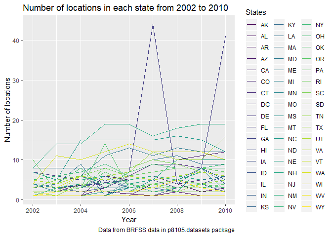

P8105\_hw3\_sy2825
================
Shuo Yan (sy2825)
2018-10-12

Problem 1
=========

First, let's import and clean the BRFSS data.

``` r
library(p8105.datasets)

data(brfss_smart2010)

brfss_clean = janitor::clean_names(brfss_smart2010) %>%
  rename(state = locationabbr, state_and_county = locationdesc, lower_confidence_limit = confidence_limit_low, 
         higher_confidence_limit = confidence_limit_high) %>%
  filter(topic == "Overall Health") %>%
  select(year, state, state_and_county, response) %>%
  mutate(
    response = factor(response, c("Excellent", "Very good", "Good", "Fair", "Poor"))
  )
  
  
 
brfss_clean
```

    ## # A tibble: 10,625 x 4
    ##     year state state_and_county      response 
    ##    <int> <chr> <chr>                 <fct>    
    ##  1  2010 AL    AL - Jefferson County Excellent
    ##  2  2010 AL    AL - Jefferson County Very good
    ##  3  2010 AL    AL - Jefferson County Good     
    ##  4  2010 AL    AL - Jefferson County Fair     
    ##  5  2010 AL    AL - Jefferson County Poor     
    ##  6  2010 AL    AL - Mobile County    Excellent
    ##  7  2010 AL    AL - Mobile County    Very good
    ##  8  2010 AL    AL - Mobile County    Good     
    ##  9  2010 AL    AL - Mobile County    Fair     
    ## 10  2010 AL    AL - Mobile County    Poor     
    ## # ... with 10,615 more rows

Now we can use our dataset to answer the following questions.

\*In 2002, which states were observed at 7 locations?

``` r
brfss_clean %>%
  filter(year == "2002") %>%
  group_by(state) %>%
  summarize(n_locations = n_distinct(state_and_county)) %>%
  filter(n_locations == 7)
```

    ## # A tibble: 3 x 2
    ##   state n_locations
    ##   <chr>       <int>
    ## 1 CT              7
    ## 2 FL              7
    ## 3 NC              7

From the table we can see that states CT, FL, and NC were observed at 7 locations.

\*Make a “spaghetti plot” that shows the number of locations in each state from 2002 to 2010.

``` r
brfss_clean %>%
  group_by(year, state) %>%
  summarize(n_locations = n_distinct(state_and_county)) %>%
  ggplot(aes(x = year, y = n_locations)) +
  geom_line(aes(color = state)) +
  labs(
    title = "Number of locations in each state from 2002 to 2010",
    x = "Year",
    y = "Number of locations",
    caption = "Data from BRFSS data in p8105.datasets package"
  ) +
  viridis::scale_color_viridis(
    name = "States", 
    discrete = TRUE
  )
```

 From the spaghetti plot above we can see that state FL has big differences of the number of observed locations from 2002 to 2010.

\*Make a table showing, for the years 2002, 2006, and 2010, the mean and standard deviation of the proportion of “Excellent” responses across locations in NY State.

``` r
brfss_smart2010 %>%
  janitor::clean_names() %>%
  rename(state = locationabbr, state_and_county = locationdesc, lower_confidence_limit = confidence_limit_low, 
         higher_confidence_limit = confidence_limit_high) %>%
  filter(year == "2002" | year == "2006" | year == "2010", state == "NY", response == "Excellent") %>%
  group_by(Year = year) %>%
  summarize(Mean = mean(data_value)/100, Standard_deviation = sd(data_value)/100) %>%
  knitr::kable(digits = 2)
```

|  Year|  Mean|  Standard\_deviation|
|-----:|-----:|--------------------:|
|  2002|  0.24|                 0.04|
|  2006|  0.23|                 0.04|
|  2010|  0.23|                 0.04|

From the table we can see that the mean and standard deviation of the proportion of "Excellent" responses across locations in NY state have few differences between year 2002, 2006, and 2010.
